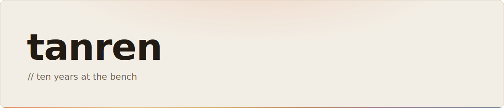

<picture>
    <source media="(prefers-color-scheme: dark)" srcset="assets/banner-dark.svg"><source media="(prefers-color-scheme: light)" srcset="assets/banner-light.svg">
    
</picture>

I'm a French programmer. I write under the name tanren, Japanese for training through repetition.

For the past decade, most of my work has been backend web systems. I work in Python, maintain long-lived applications, build integrations, automate operations, and handle application-security problems.

I care about software that stays understandable and lets people do their work without a developer standing behind them.

#### `// focus`

Backend systems · Python · application security

#### `// projects`

<!-- projects:start -->
- [jig](https://github.com/tanrendev/jig): My Claude Code toolkit. Currently guard: hooks that scan agent-driven package installs before they run.
- [paperboy](https://github.com/tanrendev/paperboy): A paperboy for job boards
<!-- projects:end -->

#### `// stack`

<!-- stack:start -->
<picture><source media="(prefers-color-scheme: dark)" srcset="assets/stack-dark.svg"></picture>
<!-- stack:end -->

#### `// now spinning`

<!-- music:start -->
<a href="https://www.youtube.com/watch?v=GkmSpbGO0eM"><picture><source media="(prefers-color-scheme: dark)" srcset="assets/music-primary-dark.svg"></picture></a>
<a href="https://www.youtube.com/watch?v=atscx8HGu9o"><picture><source media="(prefers-color-scheme: dark)" srcset="assets/music-row-1-dark.svg"></picture></a>
<a href="https://www.youtube.com/watch?v=kUakaELXA54"><picture><source media="(prefers-color-scheme: dark)" srcset="assets/music-row-2-dark.svg"></picture></a>
<!-- music:end -->

#### `// reach`

[hello@tanren.dev](mailto:hello@tanren.dev) · [tanren.dev](https://tanren.dev)
